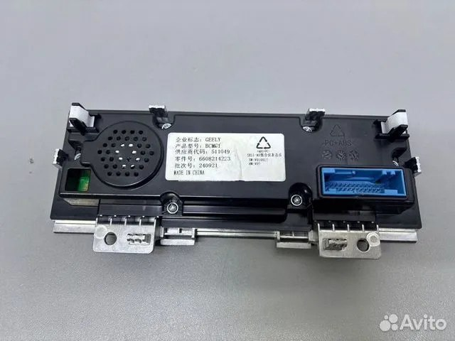

# Geely Coolray / Binyue L — реверс-инжиниринг приборной панели

Открытое исследование прошивки **цифровой приборной панели** Geely Coolray L /
Binyue L / Belgee X50+ (платформа SX11-A5) с целью её **локализации** — перевода
интерфейса с китайского на другие языки.

Этот репозиторий — **честная документация того, что удалось выяснить**: подтверждённые
факты о железе и формате данных, рабочий декодер сжатия, и открытые вопросы. Здесь нет
готового «one-click» перевода — задача пока не доведена до конца, но собранная база
позволяет продолжить её и не начинать с нуля.

> Цель — помочь сообществу сделать **бесплатную** локализацию приборки и сдвинуть тему
> с мёртвой точки. Всё открыто.

---

## TL;DR (коротко)

- Приборка Coolray/Binyue L (SX11-A5) — это **микроконтроллер Infineon TRAVEO II
  CYT3DL + 2 внешние NOR-флешки по 64 МБ**. Никакого Linux/Android на ней нет.
- Графика хранится в проприетарном формате **Infineon RLAD** (сжатие, декодится
  железом GPU). **Мы восстановили этот формат и написали рабочий декодер** — публично
  такого не было.
- Текст интерфейса хранится **не строками, а картинками-глифами** → перевод = замена
  графики шрифта, а не текстового файла.
- **Главное препятствие:** таблица ресурсов (где какой глиф лежит) хранится в
  защищённой внутренней flash микроконтроллера, которую нельзя прочитать. Без неё
  «слепой» разбор невозможен.
- **Самый реальный путь дальше:** взять дамп **тех же двух NOR-чипов** с приборки на
  другом языке и сделать **diff** с китайским — различия покажут регионы строк/глифов.

Подробности неуспешных путей и полная история исследования — в
[docs/INVESTIGATION_HISTORY.md](docs/INVESTIGATION_HISTORY.md).

---

## Железо (подтверждено)

| Компонент | Значение |
|-----------|----------|
| MCU приборки | **Infineon TRAVEO II CYT3DLABHBQ1AES** (Cortex-M7 @240 МГц + M0+, 2D-графический движок, HSM/RSA-3K) |
| Внутр. flash MCU | 4 МБ code-flash (защищена HSM от чтения) |
| Внешняя память | **2 × Infineon SEMPER NOR S25HL512T** (позиции U17, U18), по 64 МБ |
| EEPROM | 24C16 (пробег/конфиг, отдельная микросхема) |

Идентификация подтверждена меню диагностического инструмента (OBDSTAR) и независимо
владельцами на профильных форумах (тот же чип на других Coolray/Binyue).

### Плата приборки (обратная сторона)

Маркировка на наклейке: **GEELY**, продукт **BCM6T**, номер детали **6608214223**,
код поставщика 511049, партия 240921, **Made in China**. На плате — обозначение
**SX11-A5 仪表总成** (приборка в сборе SX11-A5). Справа виден основной разъём
(питание + CAN), слева — динамик.

---

## Ключевой вывод об архитектуре

Приборка SX11-A5 использует **принципиально другой подход**, чем остальные приборки
Geely (Preface / Boyue / Monjaro):

- Это **самодостаточный дизайн на микроконтроллере**: TRAVEO II (Cortex-M7 — это МК,
  а не прикладной процессор, у него нет MMU под полноценную ОС) + 4 МБ внутренней
  flash + 2×64 МБ внешних NOR. **И всё** — вся приборка умещается в **~128 МБ**.
- **Linux/QNX-подсистемы здесь нет** и быть не может (не то железо). Соответственно
  **нет и отдельного гигабайтного eMMC**.
- Для сравнения: приборка Geely Preface даёт дамп **~8 ГБ** — там совсем другое железо
  (прикладной процессор + Linux + Kanzi + eMMC). **Тот подход к нам не применим.**
- Это объясняет, почему по отзывам сервисов **A5 — самая сложная приборка Geely**
  для перевода (новый минималистичный подход, а не привычный Linux+Kanzi).

---

## Формат данных (подтверждено)

- Графический стек — штатный **Infineon Graphics Driver** (`tviic2d-gfx-mw`).
- Данные в NOR **не зашифрованы** (проверено по распределению байт), но **сжаты**
  проприетарным кодеком Infineon **RLAD** (Run-Length Adaptive Dithering). Декодер
  RLAD в норме реализован аппаратно (GPU чипа); публичного софт-декодера не
  существовало.
- Контейнер начинается с сигнатуры `A5A5A5A5`, данные — со смещения `0x180000`.
- **Текст = индексы глифов**, а не строки. Читаемого текста (ни китайского, ни
  английского) в дампах нет — все надписи нарисованы как графика.

Точный разбор формата RLAD — в [docs/RLAD_FORMAT.md](docs/RLAD_FORMAT.md).

---

## Дампы прошивки

Дампы двух NOR-флешек приборки (U17 и U18, по 64 МБ) в сам репозиторий не включены
(размер + авторское право). Они выложены отдельно:

**📦 [Скачать дампы (Яндекс.Диск)](https://disk.yandex.by/d/vSQ8tQrcU28Sog)**

- `Coolray_25_Dash_U17.bin` — дамп NOR U17 (64 МБ)
- `Coolray_25_Dash_U18.bin` — дамп NOR U18 (64 МБ)

Сняты с приборки Geely Coolray L / Binyue L (SX11-A5), интерфейс на китайском.
Как их использовать — в [docs/SETUP.md](docs/SETUP.md).

> ⚠️ Дампы содержат заводскую прошивку приборки. Идентифицирующие данные (VIN, пробег)
> обычно хранятся в отдельной EEPROM (24C16), а не в этих NOR — но если планируете
> делиться СВОИМ дампом, проверьте его на приватные данные перед публикацией.

---

## Что в репозитории работает

- **`geely_cluster/rlad_decoder.py`** — декодер формата RLAD. Восстановлен методом
  «оракула» (референс-энкодер Infineon кодирует контролируемые картинки, мы разбираем
  выход) и **проверен**: `decode(encode(x)) == x` на контролируемых входах, идеально
  восстанавливает тестовый глиф. **Это главный результат проекта.**
- **`geely_cluster/rlc_decoder.py`** — декодер RLC/RLD, восстановлен из дизассемблера
  библиотеки Infineon, проверен round-trip.
- **`geely_cluster/surface.py`** — парсер 20-байтного surface-дескриптора Infineon.
- **`tools/`** — вспомогательные скрипты: дизассемблер библиотек Infineon (capstone),
  oracle-харнесс, детекторы/сканеры регионов, рендер в изображение.

Требования: Python 3, `pip install capstone pillow`.

---

## Чего НЕ хватает и что мешает

Главный барьер — **отсутствие таблицы ресурсов**. Она описывает, где начинается каждый
глиф/картинка и какие у него размеры/формат. Эта таблица зашита во **внутренней flash
микроконтроллера** (4 МБ, защищена HSM от чтения), а в NOR-дампах её нет. Без неё
декодер не на что «навести» — «слепой» перебор даёт шум.

Мы проверили множество способов найти её или обойти (поиск дескрипторов, указателей,
сигнатур глифов, текста, таблиц адресов) — все дали отрицательный результат. Подробно и
честно об этом — в [docs/INVESTIGATION_HISTORY.md](docs/INVESTIGATION_HISTORY.md).

---

## Что даст сдвиг (как продолжить)

По приоритету достижимости:

1. **Дамп тех же двух NOR-чипов с приборки на другом языке** (RU/EN/AR) → `diff` с
   китайским дампом покажет изменённые регионы = строки/глифы. Раз вся приборка в
   128 МБ, вся разница между языками — именно в этих чипах. **Самый прямой путь.**
2. **Заводской bin / update-пакет прошивки приборки** (дилерское ПО, OTA) — если
   содержит несколько языков, тот же diff внутри одного файла.
3. **Фото конкретного китайского символа с экрана** — пиксельный эталон, под который
   можно подобрать формат/смещение в дампе.
4. **Дамп внутренней flash MCU** (SWD/JTAG) — там таблица ресурсов, но чтение почти
   наверняка заблокировано HSM. Наименее достижимо.

С любым из этих входов готовый декодер RLAD применяется сразу.

⚠️ **Важно про риск:** на этой платформе прошивка заливается целиком в чип. Без
проверенного бэкапа и версии для отката высок риск **окирпичить** приборку. Не шить
вслепую.

---

## Дисклеймер

Исследование сделано для локализации **собственного автомобиля** (перевод интерфейса
под родной язык) — это законное право владельца. Не является обходом чужой защиты.

Часть выводов получена с помощью ИИ-ассистента и **требует независимой перепроверки**
(авторы — не профессиональные reverse-инженеры). Относитесь к утверждениям критически,
проверяйте на своём железе. Никаких гарантий; вся ответственность за применение —
на вас (см. [LICENSE](LICENSE)).

Дампы прошивки, SDK Infineon и проприетарный энкодер Infineon в репозиторий **не
включены** по соображениям авторского права. Как их получить — описано в документации.
