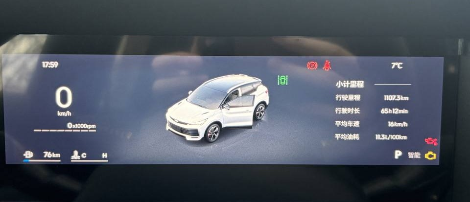
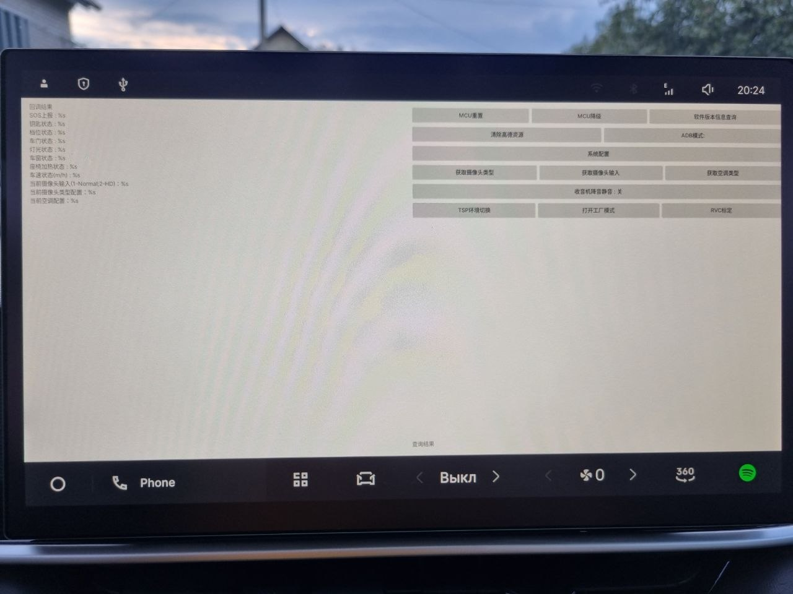
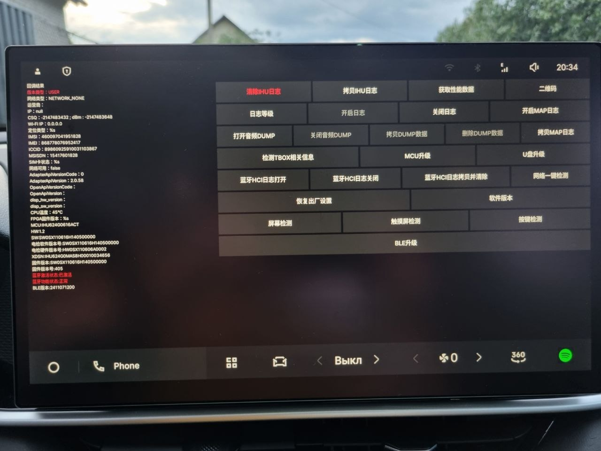

# Geely Coolray / Binyue L — реверс-инжиниринг приборной панели

Открытое исследование прошивки **цифровой приборной панели** Geely Coolray L /
Binyue L / Belgee X50+ (платформа SX11-A5) с целью её **локализации** — перевода
интерфейса с китайского на другие языки.

Этот репозиторий — **честная документация того, что удалось выяснить**: подтверждённые
факты о железе и формате данных, рабочий декодер сжатия, и открытые вопросы. Здесь нет
готового «one-click» перевода — задача пока не доведена до конца, но собранная база
позволяет продолжить её и не начинать с нуля.

> Цель — помочь сообществу сделать **бесплатную** локализацию приборки и сдвинуть тему
> с мёртвой точки. Всё открыто.

---

## TL;DR (коротко)

- Приборка Coolray/Binyue L (SX11-A5) — это **микроконтроллер Infineon TRAVEO II
  CYT3DL + 2 внешние NOR-флешки по 64 МБ**. Никакого Linux/Android на ней нет.
- Графика хранится в проприетарном формате **Infineon RLAD** (сжатие, декодится
  железом GPU). **Мы восстановили этот формат и написали рабочий декодер** — публично
  такого не было.
- Текст интерфейса хранится **не строками, а картинками-глифами** → перевод = замена
  графики шрифта, а не текстового файла.
- **Главное препятствие:** таблица ресурсов (где какой глиф лежит) хранится в
  защищённой внутренней flash микроконтроллера, которую нельзя прочитать. Без неё
  «слепой» разбор **сжатых RLAD**-ресурсов невозможен.
- **🎯 ПРОРЫВ (2026-07-08):** часть графики хранится **несжатым сырым A8** (1 байт =
  1 пиксель), а не RLAD — и её удалось извлечь напрямую из дампа. Достали **полную
  библиотеку иконок приборки** (~64–68 телльтейлов: медиа, авто, спидометры, замки,
  предупреждения и т.д.), зона иконок ~`0x28F8000..0x2940000` (иногда удобнее стартовать с
  `0x28F4000`), stride 48 px. Иконки **продублированы на оба чипа** (U17/U18), границы зоны
  между чипами чуть различаются. Подробности — [docs/SUCCESSFUL_FINDINGS.md](docs/SUCCESSFUL_FINDINGS.md).
- **Самый реальный путь дальше:** взять дамп **тех же двух NOR-чипов** с приборки на
  другом языке и сделать **diff** с китайским — различия покажут регионы строк/глифов.

Подробности неуспешных путей и полная история исследования — в
[docs/INVESTIGATION_HISTORY.md](docs/INVESTIGATION_HISTORY.md); **успешные находки** — в
[docs/SUCCESSFUL_FINDINGS.md](docs/SUCCESSFUL_FINDINGS.md).

## Как выглядит приборка (что переводим)

Заводской китайский интерфейс приборки Geely Coolray L / Binyue L (SX11-A5):

Больше эталонных фото (китайский оригинал в тёмной и светлой темах,
заводской русский перевод для рынка Казахстана, неоригинальный французский перевод) —
в папке [`photos/`](photos/). Они служат справочным материалом для сверки при будущем
diff-анализе.

---

## Железо (подтверждено)

| Компонент | Значение |
|-----------|----------|
| MCU приборки | **Infineon TRAVEO II CYT3DLABHBQ1AES** (Cortex-M7 @240 МГц + M0+, 2D-графический движок, HSM/RSA-3K) |
| Внутр. flash MCU | 4 МБ code-flash (защищена HSM от чтения) |
| Внешняя память | **2 × Infineon SEMPER NOR S25HL512T** (позиции U17, U18), по 64 МБ |
| EEPROM | 24C16 (VIN/пробег/конфиг — per-car данные, отдельная микросхема, НЕ в NOR) |

Идентификация подтверждена меню диагностического инструмента (OBDSTAR) и независимо
владельцами на профильных форумах (тот же чип на других Coolray/Binyue).

### Расшифровка маркировок

Каждый символ в маркировке кодирует характеристику чипа. Разбор наших двух микросхем
по даташитам Infineon/Cypress:

**MCU `CYT3DLABHBQ1AES`** — Infineon TRAVEO II:
- `CYT3` — TRAVEO II (T2G), `D` — ядро **Cortex-M7** (+ вспомогательный M0+)
- `L` — **4160 КБ** flash / 384 КБ SRAM, `AB` — корпус **216-TEQFP**
- `HB` — **защита включена (HSM + RSA-3K)** — именно это закрывает внутреннюю flash от
  чтения (см. NOR ниже и [docs/INFINEON_REPOS.md](docs/INFINEON_REPOS.md))
- `Q1` — automotive, −40…+105 °C

> 💡 **Ищите документацию и софт по базовой части `CYT3DL`**, а не по полному коду
> `CYT3DLABHBQ1AES`. Хвост (`ABHBQ1AES`) — это специфика модификации (корпус, объём flash,
> grade, ревизия), по нему почти ничего не найти. По базе `CYT3DL` материалов много
> (даташиты, reference manual, application notes, примеры, форумы), и все они применимы к
> нашему чипу — модификация меняет цифры (объём/корпус), но не архитектуру.

**NOR-память `S25HL512TFB01`** — Cypress/Infineon SEMPER, две штуки (U17 и U18):
- `S25` — SEMPER NOR, `HL` — **3.0 В**, `512` — **64 МБ** на чип
- `B` — корпус **BGA-24**, `01` — automotive
- Ответ на команду RDID (`9F`) — JEDEC-байты **`34 2A 1A`**, подтверждают чип
- `HL` + `B` (3.0 В, BGA-24) определяют программатор; 64 МБ требуют 4-байтовой адресации
  — подробности в [docs/INFINEON_REPOS.md](docs/INFINEON_REPOS.md)

**Итог:** вся память приборки — это **1 × CYT3DLABHBQ1AES + 2 × S25HL512TFB01
(по 64 МБ)**. Графика лежит во внешних NOR (их читаем), а таблица привязки ресурсов —
во внутренней flash MCU (закрыта HSM).

### Плата приборки (обратная сторона)

Маркировка на наклейке: **GEELY**, продукт **BCM6T**, номер детали **6608214223**,
код поставщика 511049, партия 240921, **Made in China**. На плате — обозначение
**SX11-A5 仪表总成** (приборка в сборе SX11-A5). Справа виден основной разъём
(питание + CAN), слева — динамик.

### Родственная модель — Geely EX2 (то же железо)

По информации сообщества, **приборка и ГУ у Geely EX2 аппаратно такие же**, как у нашей
машины (прошивки, разумеется, отличаются). Польза EX2 — **справочная**:

- **Расширяет круг поиска.** Материалы, обсуждения и наработки по приборке/ГУ **EX2**
  применимы к нам на уровне железа — стоит искать по обеим моделям.
- **Подтверждает механизм.** На EX2 язык приборки задаётся от ГУ по CAN (см.
  [docs/GLOBAL_VERSION_MULTILANG.md](docs/GLOBAL_VERSION_MULTILANG.md), «Наблюдение 4»).

> ⚠️ **EX2 НЕ подходит как донор самого дампа.** Железо то же, но **прошивка и графика
> другие** (иные картинки, разметка ресурсов, версии) — его образ нельзя ни залить нам
> напрямую, ни использовать для `diff` (регионы не совпадут). EX2 — только справка, не
> источник данных.

Донор конкретных данных должен быть на **том же железе И с нужной локализацией** —
это **мультиязычные версии Coolray/X50+**:
- **глобальная версия Coolray** — **6 языков** (включая русский);
- **Belgee X50+** — **4 языка** (по данным сообщества).

Для нашей цели русского и английского достаточно, поэтому любой из этих двух доноров
подходит. Требует проверки соответствия версий железа на конкретном экземпляре.

---

## Ключевой вывод об архитектуре

Приборка SX11-A5 использует **принципиально другой подход**, чем остальные приборки
Geely (Preface / Boyue / Monjaro):

- Это **самодостаточный дизайн на микроконтроллере**: TRAVEO II (Cortex-M7 — это МК,
  а не прикладной процессор, у него нет MMU под полноценную ОС) + 4 МБ внутренней
  flash + 2×64 МБ внешних NOR. **И всё** — вся приборка умещается в **~128 МБ**.
- **Linux/QNX-подсистемы здесь нет** и быть не может (не то железо). Соответственно
  **нет и отдельного гигабайтного eMMC**.
- Для сравнения: приборка Geely Preface даёт дамп **~8 ГБ** — там совсем другое железо
  (прикладной процессор + Linux + Kanzi + eMMC). **Тот подход к нам не применим.**
- Это объясняет, почему **A5 — самая сложная приборка Geely** для перевода: новый
  минималистичный подход вместо привычного Linux+Kanzi. **Крупным игрокам рынка
  автопереводов её перевести не удалось** — единственная известная успешная
  локализация сделана энтузиастами из Алжира в коллаборации с одной СНГ-командой
  переводов (метод не раскрыт).

---

## Формат данных (подтверждено)

- Графический стек — штатный **Infineon Graphics Driver** (`tviic2d-gfx-mw`).
- Данные в NOR **сжаты** проприетарным кодеком Infineon **RLAD** (Run-Length Adaptive
  Dithering). Декодер RLAD в норме реализован аппаратно (GPU чипа); публичного
  софт-декодера не существовало.
  > ⚠️ Ранее тут стояло «не зашифрованы (проверено по распределению байт)» — это
  > **отозвано**: распределение байт (chi-square) не отличает сжатие от шифрования, а из
  > реального дампа ни один ресурс не декодировался. Возможно, графика **зашифрована
  > at-rest** (SMIF on-the-fly AES) — вопрос открыт. Разбор: docs/INFINEON_REPOS.md →
  > «SMIF on-the-fly AES» и «Метод алжирцев».
- Контейнер начинается с сигнатуры `A5A5A5A5`, данные — со смещения `0x180000`.
- **Текст = индексы глифов**, а не строки. Читаемого текста (ни китайского, ни
  английского) в дампах нет — все надписи нарисованы как графика.

Точный разбор формата RLAD — в [docs/RLAD_FORMAT.md](docs/RLAD_FORMAT.md).

---

## Дампы прошивки

Дампы двух NOR-флешек приборки (U17 и U18, по 64 МБ) в сам репозиторий не включены
(размер + авторское право). Они выложены отдельно:

**📦 [Скачать дампы (Яндекс.Диск)](https://disk.yandex.by/d/vSQ8tQrcU28Sog)**

- `Coolray_25_Dash_U17.bin` — дамп NOR U17 (64 МБ)
- `Coolray_25_Dash_U18.bin` — дамп NOR U18 (64 МБ)

Сняты с приборки Geely Coolray L / Binyue L (SX11-A5), интерфейс на китайском.
Как их использовать — в [docs/SETUP.md](docs/SETUP.md).

> ⚠️ Дампы содержат заводскую прошивку приборки. Идентифицирующие данные (VIN, пробег)
> обычно хранятся в отдельной EEPROM (24C16), а не в этих NOR — но если планируете
> делиться СВОИМ дампом, проверьте его на приватные данные перед публикацией.

> ℹ️ Следствие для diff: раз per-car данные (VIN/пробег/конфиг) лежат в отдельной EEPROM,
> а не в NOR, два дампа разных машин **с одинаковой версией прошивки** потенциально
> идентичны между собой. Значит различия при diff — это, скорее всего, версия/язык, а не
> «мусор» от конкретной машины. Требует проверки. (Дамп снят выпаиванием чипов +
> программатором.)

---

## Источники инструментов — открытая экосистема Infineon TRAVEO

**Главная отправная точка для работы с форматами приборки.** Приборка построена на
Infineon TRAVEO II, и у Infineon SDK и инструменты **выложены публично**. Именно
благодаря этому удалось восстановить формат RLAD. Три ключевых репозитория Infineon:

| Инструмент | Репозиторий |
|-----------|-------------|
| **SDK** (заголовки форматов, библиотеки) | https://github.com/Infineon/tviic2d-gfx-mw |
| **rlad-encoder.exe** (оракул RLAD) | https://github.com/Infineon/mtb-example-psoc-edge-gfx-rlad |
| **ResourceGenerator.exe** (генератор ресурсов, оракул формата) | https://github.com/Infineon/mtb-t2g-example-graphics-sample-drawing |

Метод «оракула»: прогоняем эти официальные утилиты на контролируемых картинках и
разбираем их вывод, чтобы восстановить бинарный формат. Так вскрыт RLAD (см.
[docs/RLAD_FORMAT.md](docs/RLAD_FORMAT.md)). Подробности установки — в
[docs/SETUP.md](docs/SETUP.md).

**Полный разбор всех релевантных репозиториев Infineon** (11 graphics-примеров, SDK,
инструменты — что в них есть и чего принципиально нет для нашей задачи) — в
[docs/INFINEON_REPOS.md](docs/INFINEON_REPOS.md).

---

## Что в репозитории работает

- **`geely_cluster/rlad_decoder.py`** — декодер формата RLAD. Восстановлен методом
  «оракула» (референс-энкодер Infineon кодирует контролируемые картинки, мы разбираем
  выход) и **проверен**: `decode(encode(x)) == x`, идеально восстанавливает тестовый
  глиф. **Это главный результат проекта.** Поддерживает **два формата**:
  - `decode_image` — **RGBA8888** (4 канала);
  - `decode_a8_image` — **A8** (1 канал alpha) — это **формат глифов шрифта** приборки.
- **`geely_cluster/rlc_decoder.py`** — декодер RLC/RLD, восстановлен из дизассемблера
  библиотеки Infineon, проверен round-trip.
- **`geely_cluster/surface.py`** — парсер 20-байтного surface-дескриптора Infineon.
- **`tools/`** — вспомогательные скрипты: дизассемблер библиотек Infineon (capstone),
  oracle-харнесс, детекторы/сканеры регионов, рендер в изображение.
  - **`tools/sector_map.py`** — обзор всего чипа одной картинкой (`overview`), карта
    секторов по типу содержимого (`sectors`), сырой рендер участка (`raw`). Для быстрой
    оценки раскладки дампа.
  - **`tools/bit_closure.py`** — эксперимент по привязке ширины глифа к длине ресурса из
    diff-границ (проверен, не селективен — см. INVESTIGATION_HISTORY §2a).
  > Итог структурного анализа дампов (≈9 подходов, все отклонены) — в
  > [docs/INVESTIGATION_HISTORY.md](docs/INVESTIGATION_HISTORY.md) §2a. Слепой разбор
  > двух дампов одной машины закрыт доказательно; нужен либо второй язык (diff), либо
  > штатный S19 flash-файл. **Не повторять эти проверки с нуля.**
- **`tests/`** — автономный тест декодера на зашитых тест-векторах (проверяет корректность RLAD-декодера без проприетарного энкодера, включая A8-глиф и построчность):
  `python tests/test_rlad_decoder.py` → `8/8 passed`.

Требования: Python 3.9+, `pip install -r requirements.txt` (capstone + pillow).

---

## Чего НЕ хватает и что мешает

Главный барьер — **отсутствие таблицы ресурсов**. Она описывает, где начинается каждый
глиф/картинка и какие у него размеры/формат. Эта таблица зашита во **внутренней flash
микроконтроллера** (4 МБ), а в NOR-дампах её нет. Без неё декодер не на что «навести» —
«слепой» перебор даёт шум.

Прочитать **внутреннюю secure-flash самого MCU** через отладку (SWD/JTAG) **невозможно**:
приборка — серийное устройство в SECURE lifecycle, маркировка чипа `HB` (security ON), а при
каждом включении mask-ROM применяет ограничения на debug-порт. Подтверждено даташитом
CYT3DL (§8/§3.4) + реальным кейсом Infineon-community на нашем чипе CYT3DLABHBQ1AES
(см. [docs/INFINEON_REPOS.md](docs/INFINEON_REPOS.md)). При этом внешний NOR читается
программатором свободно — дампы у нас есть.

> ℹ️ Это про **внутреннюю flash MCU** (где таблица ресурсов). Отдельная операция — чтение
> **внешнего NOR через XIP-окно `0x60000000`** на работающей приборке по JTAG (память,
> которую CPU видит штатно после boot) — по данным сообщества рабочая (метод алжирцев).
> Одно другому не противоречит: это разные адресные пространства. Разбор —
> [docs/INFINEON_REPOS.md](docs/INFINEON_REPOS.md) → «Метод алжирцев: JTAG через XIP-окно».

Мы проверили множество способов найти таблицу или обойти её (дескрипторы, указатели,
сигнатуры глифов, текст, таблицы адресов, служебные зоны NOR, цепочки заголовков,
инструменты Infineon) — 15 направлений, все с отрицательным результатом. Слепой поиск
глифов перепроверен с полностью рабочим A8-декодером на **обоих** NOR-чипах (U17 и
U18) — везде шум, глифов нет (это ещё раз доказывает, что барьер не в декодере, а в
отсутствии таблицы). Подробно и честно — в
[docs/INVESTIGATION_HISTORY.md](docs/INVESTIGATION_HISTORY.md).

---

## Что даст сдвиг (как продолжить)

По приоритету достижимости:

1. **Дамп тех же двух NOR-чипов с приборки на другом языке** (RU/EN/AR) → `diff` с
   китайским дампом покажет изменённые регионы = строки/глифы. Раз вся приборка в
   128 МБ, вся разница между языками — именно в этих чипах. **Самый прямой путь.**
   Отличный источник такого дампа — **глобальная версия авто**: там мультиязычность
   (включая русский) штатная, а значит и глифы уже есть. Подробно —
   [docs/GLOBAL_VERSION_MULTILANG.md](docs/GLOBAL_VERSION_MULTILANG.md).
   Подходящий донор — мультиязычная версия того же железа: **глобальный Coolray**
   (6 языков) или **Belgee X50+** (4 языка). ⚠️ **EX2 для этого не годится** — железо то
   же, но прошивка и графика другие (см. раздел «Железо» → «Родственная модель»).
2. **Заводская прошивка приборки от дилера Geely (запрос в Китай).** Возможно, **самый
   быстрый путь**: получить через дилерскую сеть оригинальный образ прошивки приборки, а
   затем залить кастомную (переведённую) версию по UDS. Запись прошивки по UDS
   (`RequestDownload`) на приборке **работает — проверено** (см.
   [docs/PRACTICAL_APPROACH.md](docs/PRACTICAL_APPROACH.md)).
3. **Заводской bin / update-пакет прошивки приборки** (дилерское ПО, OTA) — если
   содержит несколько языков, тот же diff внутри одного файла.
4. **Фото конкретного китайского символа с экрана** — пиксельный эталон, под который
   можно подобрать формат/смещение в дампе.
5. **JTAG-съём NOR через XIP-окно `0x60000000` на работающей приборке** — читает данные,
   которые CPU видит штатно после boot (расшифрованные + с разложенной разметкой), НЕ
   вскрывая secure-flash MCU. По данным сообщества — рабочий путь (метод алжирцев). Прямой
   дамп самой внутренней flash MCU через debug при этом **невозможен** (SECURE + маркировка
   HB, подтверждено) — но он и не нужен. Разбор — [docs/INFINEON_REPOS.md](docs/INFINEON_REPOS.md).
6. **Доступ к myICP / папке `03_build`** (бесплатная регистрация myInfineon + запрос на
   traveo@infineon.com) — там исходники ResourceGenerator и RLAD-кодека: точный формат
   контейнера + ссылочный декодер/энкодер для обратной сборки. НЕ решает таблицу
   ресурсов, но даёт проверенный формат. Детали — [docs/INFINEON_REPOS.md](docs/INFINEON_REPOS.md).

С любым из входов 1, 3, 4 готовый декодер RLAD применяется сразу; вход 2 — самый быстрый
на установку (готовая заводская прошивка + заливка по UDS); вход 6 усиливает
инструментарий (точный формат + энкодер).

> 💡 Есть и **другой угол зрения** на задачу: не декодировать формат изнутри, а работать
> с готовым образом NOR напрямую (снять один раз → сделать патч → тиражировать заливкой
> по диагностике). По данным сообщества, так это и делается на практике — подробно и с
> оговорками в [docs/PRACTICAL_APPROACH.md](docs/PRACTICAL_APPROACH.md).

### Инженерное меню головного устройства (проверено)

В головном устройстве (ГУ) есть скрытое **инженерное меню** — существует **два разных
вида**. Проверено на нашей машине: **к приборке оно доступа не даёт** — обновление MCU и
выгрузка DUMP/логов относятся к самому ГУ, а не к приборке (Infineon CYT3DL). То есть снять
дамп приборки или залить в неё перевод через это меню **нельзя**. Полный разбор обоих меню
с переводом всех пунктов на русский и доказательствами — в
[docs/ENGINEERING_MENU.md](docs/ENGINEERING_MENU.md).

Два вида инженерного меню ГУ:

⚠️ **Важно про риск:** на этой платформе прошивка заливается целиком в чип. Без
проверенного бэкапа и версии для отката высок риск **окирпичить** приборку. Не шить
вслепую.

---

## Потенциально полезные ссылки (сообщество)

Гипотетически полезные контакты/материалы. **Важно:** это в основном по **Coolray
1-го рестайлинга (SX11-A3)**, а у нас **2-й рестайлинг (SX11-A5) с другой приборкой**.
Рабочее у них решение **не факт что применимо к нам** — приборки отличаются
архитектурой. Проверяйте применимость к своей модели.

- Тема по приборке Coolray на drive2:
  https://www.drive2.ru/r/geely/coolray/682905023817984515/

Если знаете рабочий метод именно для **SX11-A5** — заведите Issue (см.
[CONTRIBUTING.md](CONTRIBUTING.md)).

---

## Дисклеймер

Исследование сделано для локализации **собственного автомобиля** (перевод интерфейса
под родной язык) — это законное право владельца. Не является обходом чужой защиты.

Часть выводов получена с помощью ИИ-ассистента и **требует независимой перепроверки**
(авторы — не профессиональные reverse-инженеры). Относитесь к утверждениям критически,
проверяйте на своём железе. Никаких гарантий; вся ответственность за применение —
на вас (см. [LICENSE](LICENSE)).

Дампы прошивки, SDK Infineon и проприетарный энкодер Infineon в репозиторий **не
включены** по соображениям авторского права. Как их получить — описано в документации.
